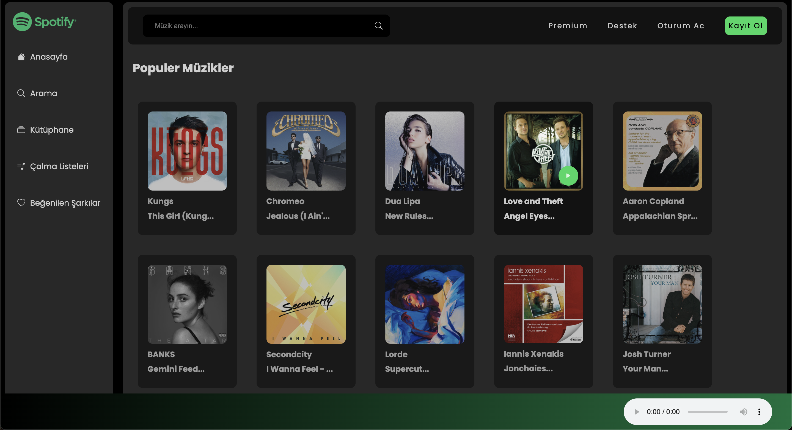
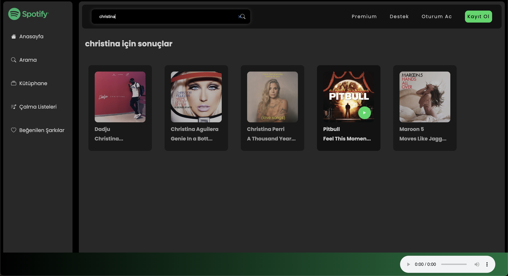

# Spotify Clone

This project is a Spotify clone application developed using JavaScript. It allows users to play popular music by fetching data from Rapid API and offers a sleek, modern design styled with SCSS.

## Screenshots 🖼️

### Video GIF


### MainPage



### searchResults



## Features

- Popular Music Playback: Users can browse and play popular songs fetched from Rapid API.
- Dynamic Data: The application fetches real-time music data, ensuring an updated experience.
- Responsive Design: A user-friendly and responsive interface styled with SCSS.

## Installation and Usage

1. Clone the repository:

```
git clone https://github.com/ozerbaykal/SpotifyClone.git

```

2. Navigate to the project directory:

```
cd SpotifyClone

```

3. Go live server

4. Open the index.html file in your browser to view the application.

## Technologies Used

- JavaScript:For handling application logic and API integration.
- Rapid API: To fetch real-time music data.
- SCSS: For advanced styling and responsiveness.

## Development Process

This project was designed to provide a simple yet This Spotify clone was created to provide a simple yet enjoyable music streaming experience. Future enhancements may include features like search functionality, playlists, and user authentication.

Note: Ensure you have a valid Rapid API key to fetch music data properly.

## Contributing

Contributions are welcome! Please open an issue first to discuss what you would like to change.

- 1.Fork the project
- 2.Create your feature branch (git checkout -b feature/NewFeature)
- 3.Commit your changes (git commit -m 'Add new feature')
- 4.Push to the branch (git push origin feature/NewFeature)
- 5.Open a Pull Request

## Contact 📬

**Özer BAYKAL**  
Email: [baykalozer87@gmail.com](mailto:baykalozer87@gmail.com)  
Project Link: [Movie App on GitHub](https://github.com/ozerbaykal/SpotifyClone)
